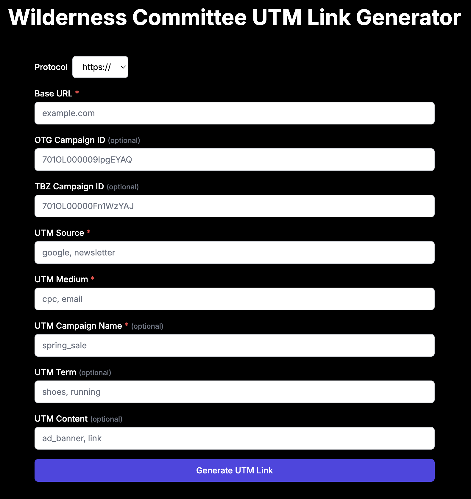

# Wilderness Committee UTM Link Generator

This is a simple UTM Link Generator web app built with Next.js and Tailwind CSS. The app allows you to generate UTM links easily by filling out a form with relevant campaign parameters.

## Features

- Select protocol (`http` or `https`).
- Input fields for base URL and UTM parameters such as `utm_source`, `utm_medium`, `utm_campaign`, and more.
- Optionally add `OTG Campaign ID` and `TBZ Campaign ID`.
- Generates the UTM link and displays it for copying and sharing.

## Screenshot



## Live Demo

You can use the UTM Link Generator by visiting [this link](https://wilderness-committee.github.io/wc-utm-calc/).

## Getting Started

### Prerequisites

Make sure you have Node.js and npm installed on your machine.

### Installation

1. Clone the repository:

   ```bash
   git clone https://github.com/wilderness-committee/wc-utm-calc.git
   ```

2. Navigate to the project folder:

   ```bash
   cd wc-utm-calc
   ```

3. Install dependencies:

   ```bash
   npm install
   ```

### Running the App

To run the app locally, use:

```bash
npm run dev
```

Then open [http://localhost:3000](http://localhost:3000) to see the app in your browser.

## Usage

1. Enter the required and optional fields.
2. Click "Generate UTM Link".
3. The generated UTM link will appear for you to copy.

## License

This project is licensed under the MIT License.